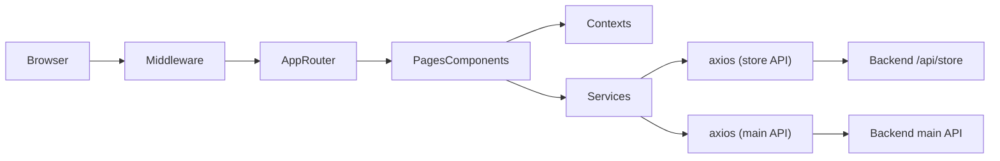

# Architecture — OUPharmacy Store (frontend)

## Tổng quan

Ứng dụng **Next.js App Router** (SSR/RSC + client components nơi cần). **next-intl** bọc `RootLayout` để đa ngôn ngữ; middleware chuẩn hóa path (bỏ prefix locale legacy, redirect checkout cũ).

**Backend** xử lý dữ liệu nằm **ngoài repo** (HTTP). Repo này chứa storefront: UI, client state, và client gọi REST.

## Luồng request (điển hình)

- **Middleware** (`src/middleware.ts`): redirect, matcher cho `/don-hang`, `/tai-khoan`; không còn ép redirect login server-side toàn phần — modal login phía client.
- **Trang** (`src/app/...`): compose sections/components; data qua hooks hoặc gọi service trực tiếp / React Query (tuỳ chỗ).
- **Contexts** (`src/contexts/`): trạng thái session giỏ, checkout, wishlist, auth UI.
- **Services** (`src/lib/services/`): biến đổi request/response, URL từ `NEXT_PUBLIC_*`.

## Hai “cổng” HTTP chính

| Cổng | File / pattern | Env |
|------|----------------|-----|
| Store API (catalog, cart-shaped store endpoints, …) | `src/lib/api.ts`, nhiều service dùng `fetch` hoặc instance | `NEXT_PUBLIC_API_URL` |
| Main API (user, OAuth, địa chỉ, …) | `src/lib/services/auth.ts`, `location.ts`, … | `NEXT_PUBLIC_MAIN_API_URL` |

Giữ nguyên phân tách này khi thêm endpoint — tránh gộp base URL không có chủ đích.

## Auth (khái niệm)

- Cookie `token` được middleware đọc cho route protected; UX đăng nhập chủ yếu **client** (modal).
- Firebase config: `src/lib/config/firebase.ts` (env `NEXT_PUBLIC_FIREBASE_*`).

## i18n

- Plugin: `next-intl` với config `./src/i18n/request.ts` (xem `next.config.js`).
- Messages: `src/i18n/messages/`.

## Khi thêm tính năng mới

1. Xác định route trong `src/app/` hoặc mở rộng page hiện có.
2. State chia sẻ → xem sẵn context; tránh duplicate global state.
3. Gọi dữ liệu → thêm/thay method trong `src/lib/services/`, tái dùng `api.ts` khi đúng base store.

Cập nhật file này khi thay đổi luồng lớn (auth, API gateway, i18n).
