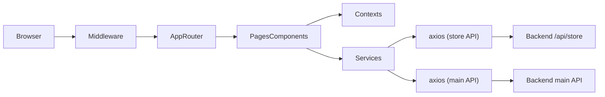

# Architecture — OUPharmacy Store (frontend)

## Tổng quan

Ứng dụng **Next.js App Router** (SSR/RSC + client components nơi cần). **next-intl** bọc `RootLayout` để đa ngôn ngữ; middleware chuẩn hóa path (bỏ prefix locale legacy, redirect checkout cũ).

**Backend** xử lý dữ liệu nằm **ngoài repo** (HTTP). Repo này chứa storefront: UI, client state, và client gọi REST.

## Luồng request (điển hình)

```mermaid
flowchart LR
  Browser --> Middleware
  Middleware --> AppRouter
  AppRouter --> PagesComponents
  PagesComponents --> Contexts
  PagesComponents --> Services
  Services --> AxiosStore["axios (store API)"]
  Services --> AxiosMain["axios (main API)"]
  AxiosStore --> BackendStore["Backend /api/store"]
  AxiosMain --> BackendMain["Backend main API"]
```

- **Middleware** (`src/middleware.ts`): redirect, matcher cho `/don-hang`, `/tai-khoan`; không còn ép redirect login server-side toàn phần — modal login phía client.
- **Trang** (`src/app/...`): compose sections/components; data qua hooks hoặc gọi service trực tiếp / React Query (tuỳ chỗ).
- **Contexts** (`src/contexts/`): trạng thái session giỏ, checkout, wishlist, auth UI.
- **Services** (`src/lib/services/`): biến đổi request/response, URL từ `NEXT_PUBLIC_*`.

## Hai “cổng” HTTP chính

| Cổng | File / pattern | Env |
|------|----------------|-----|
| Store API (catalog, cart-shaped store endpoints, …) | `src/lib/api.ts`, nhiều service dùng `fetch` hoặc instance | `NEXT_PUBLIC_API_URL` |
| Main API (user, OAuth, địa chỉ, …) | `src/lib/services/auth.ts`, `location.ts`, … | `NEXT_PUBLIC_MAIN_API_URL` |

Giữ nguyên phân tách này khi thêm endpoint — tránh gộp base URL không có chủ đích.

## Auth (khái niệm)

- Cookie `token` được middleware đọc cho route protected; UX đăng nhập chủ yếu **client** (modal).
- Firebase config: `src/lib/config/firebase.ts` (env `NEXT_PUBLIC_FIREBASE_*`).

## i18n

- Plugin: `next-intl` với config `./src/i18n/request.ts` (xem `next.config.js`).
- Messages: `src/i18n/messages/`.

## Khi thêm tính năng mới

1. Xác định route trong `src/app/` hoặc mở rộng page hiện có.
2. State chia sẻ → xem sẵn context; tránh duplicate global state.
3. Gọi dữ liệu → thêm/thay method trong `src/lib/services/`, tái dùng `api.ts` khi đúng base store.

### Smart Medicine Cabinet

- **Doc:** [`docs/smart-medicine-cabinet.md`](smart-medicine-cabinet.md) — routes, components, hooks, verify checklist.
- Route: `/tai-khoan/tu-thuoc` (login gate client). `/tu-thuoc-thong-minh` → redirect.
- **Inventory (Done):** `/cabinets/`, `/cabinet-items/`, `overview/` — tồn nhà ≠ kho `in_stock`. P2 low-stock / refill / lot / reminder / scan SKU / seed đơn (HSD tay). P3 Mua lại → `/carts/items/` (không trừ qty tủ).
- **Adjacent:** inbox HSD `/cabinet-alerts/` + panel; seed toa `/cabinet-prescription-lines/` + sheet (HSD tay, owner-only).
- BE API SoT: `Clinic-Oupharmacy-BE/docs/smart-medicine-cabinet-api.md`.
- Plans: `PersonalProject/plans/[Done] smart-medicine-cabinet.plan.md`, `[Done] smart-cabinet-adjacent-domains.plan.md`.

### Faceted search / advanced filters

- Sidebar facets từ `GET /api/store/search/` (`facets.brand`, `origin_country`, `attributes`, …).
- Attribute filters: `attrs=code:slug` — xem BE `storeApp/guidelines/catalog-attributes.md` và FE `docs/ROUTING.md` (Attribute facets).

### Home merchandising (P8 / D-20 + P9)

Fixed section frame. Taxonomy (fixtures under `src/api/mocks/`):

| Section | Source | Notes |
|---------|--------|--------|
| Hero cluster | Jazzmin placements | `HOME_HERO` / `HOME_SECONDARY` = `Subject[]` (D-21/D-22); `HOME_NOTICE_TOP` / `HOME_NOTICE_BOTTOM` = single |
| Quick cate | `HOME_QUICK_LINKS` | FE constant |
| Flash sale | Fixture chrome + `getFlashSaleProductsSSG` | D-23: `window_templates` (VN day_offset); pool daily seed; rail ≤12; **upcoming** badge `-xx%` (no revealed %); **live** shows flash −10…35%; exclude Hot IDs; not checkout (D-01) |
| Hot sale | `GET /api/store/search/?sort=popular` (SSG) | Top 12 priced; −% chỉ khi BE có `compare_at_price` / `discount_percent` **thật** (D-PRC-03); sort giảm dần theo % |
| Featured categories | `home/featured-categories.response.json` | Fixed section → later category API |
| Favorite brands | `getFavoriteBrandsSSG` (search facets) | Top 10 brands by product count; campaign display 10–35%; `bg-white`; fixture = offline reference |

Empty/error on placements → static `HeroBanner` / `PromotionalBanners` (D-08). No mock fill on CMS slots. Do not stuff flash/hot/cate into `placements.home.response.json`.

### Catalog pricing & cart economics (Option 1 — D-PRC)

SoT doc (BE): `Clinic-Oupharmacy-BE/docs/product-pricing-promotions.md` (§ Docker seed + **UAT checklist**).  
**Product / variant / unit (card & list):** `Clinic-Oupharmacy-BE/docs/store-product-strategy.md`.  
Plan: `PersonalProject/plans/[UnDone] catalog-pricing-direct-discount-refactor.plan.md`.

**Tóm tắt quan trọng**

| Khái niệm | Nghĩa |
|-----------|--------|
| `price_value` | Giá sale **thật** — giỏ & checkout |
| `compare_at_price` | Giá list / gạch — chỉ hiển thị + tính “tiết kiệm” |
| **Giảm giá trực tiếp** | `(list − sale) × qty` — **informational**, không trừ thêm subtotal |
| **Voucher** | Mã đơn (`SALE20`, …) — trừ trên subtotal sale, **tách cột** với direct |

Hot-sale BE (`seed_hot_sale_campaign`): 12 SP popular, tier 30/25/20, campaign `san-pham-ban-chay`. **Mỗi variant:** promo áp **tất cả unit published** (cùng tier %, list/sale theo từng unit). Card chỉ hiển thị compare của unit đang chọn.

| Layer | FE behavior |
|-------|-------------|
| Card / PDP | `price_value`, `compare_at_price`, `discount_percent` from API (Option A) |
| Cart line | Snapshot **sale** at add time |
| **Giảm giá trực tiếp** | `catalog_direct_savings_total` / line `list_price_snapshot` (P3) |
| **Giảm giá voucher** | `discount_amount` + `shipping_discount_amount` |

**Do not** send original price or `%` from FE on add-to-cart / checkout (D-PRC-01).

**Campaign membership (D-PRC-06 — locked 2026-08-30):**

| Rule | FE implication |
|------|----------------|
| **P1** | Một unit = một promo giá catalog effective; card/PDP/giỏ đọc API + snapshot — không synth % checkout. |
| **M1** | SKU có thể ở nhiều rail/landing; flash/hot **không** ghi đè `price_value`. |
| **V1** | Voucher sheet = campaign-published offers; cart tách **direct savings** vs **voucher** columns. |
| **UX1** | Flash **upcoming**: mask `-xx%` / `formatUpcomingPriceTeaser`; **live**: reveal cùng SoT. PDP có thể show % thật khi catalog promo đã live dù flash tab chưa onTime. |

BE ADR: `Clinic-Oupharmacy-BE/docs/product-pricing-promotions.md` § D-PRC-06.

### Campaign landing preview (D-19)

- Public: `/khuyen-mai`, `/khuyen-mai/[slug]` via `getCampaignBySlugSSG` / `getCampaignsSSG`.
- Staff preview: `/khuyen-mai/[slug]?preview=<token>` (Jazzmin-signed, TTL 2h). RSC fetch uses `cache: 'no-store'`. Banner when `is_preview`; skip `CampaignAttributionBeacon`. Index and home do not read `preview`.
- Invalid/missing token on a draft slug → same 404 as unknown slug.
- Placement images: first-party CDN only (`res.cloudinary.com` / OUPharmacy). No third-party stock hosts. Missing image → brand gradient, still readable.

Cập nhật file này khi thay đổi luồng lớn (auth, API gateway, i18n).
